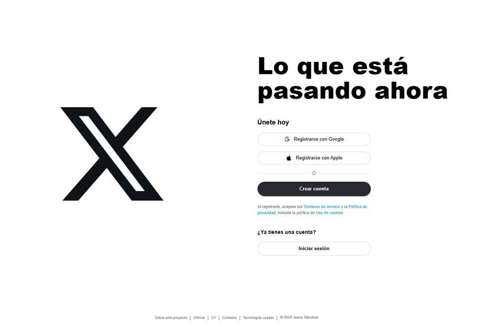
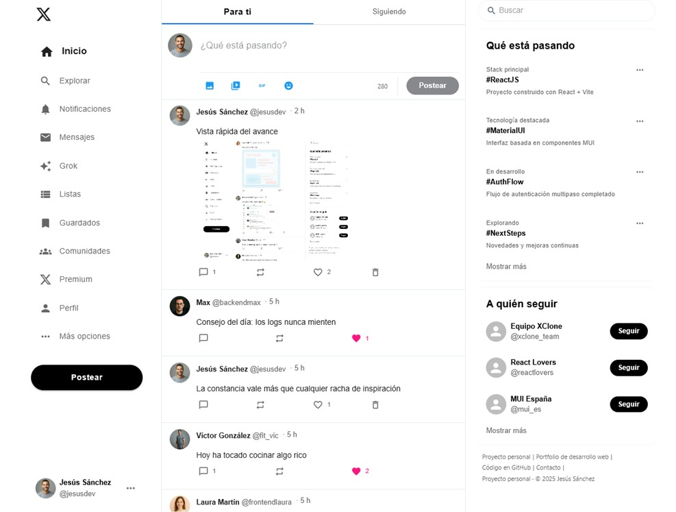
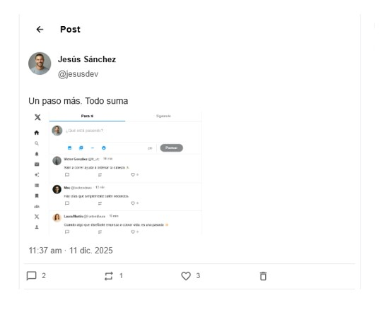
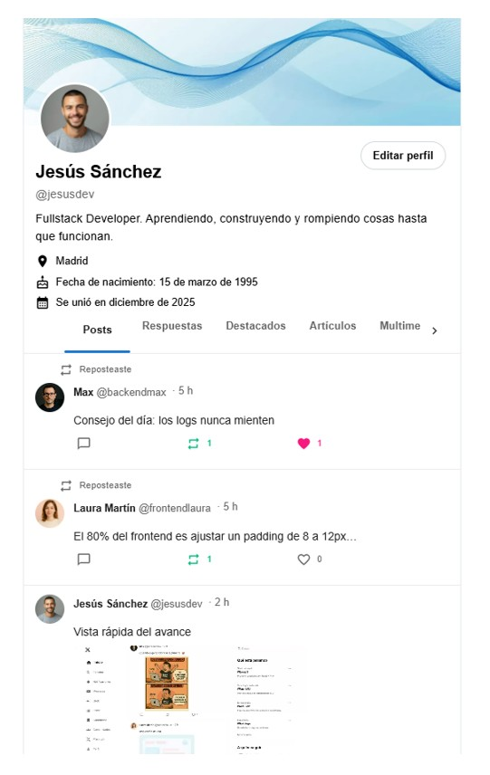

# XClone – Twitter/X Clone (Fullstack)

XClone es una aplicación web fullstack inspirada en Twitter/X, desarrollada para
demostrar habilidades reales en frontend y backend.

Incluye autenticación, publicación de tweets con texto e imagen, likes,
comentarios, retweets, perfiles de usuario y feed dinámico.

---

## 🚀 Funcionalidades principales

- Registro e inicio de sesión con autenticación JWT
- Creación de tweets con texto e imagen
- Likes, comentarios y retweets
- Feed dinámico de tweets
- Perfil de usuario editable:
  - datos básicos
  - imagen de perfil
  - imagen de portada
- Cambio de contraseña

---

## 📸 Capturas

<p align="center">
  
</p>

<p align="center">
  
</p>


---

## 🛠️ Tecnologías principales

### **Frontend**
- React  
- Vite  
- Material UI  
- Context API  
- Fetch API  
- React Router  
- date-fns  

### **Backend**
- Node.js + Express  
- MySQL  
- JOI  
- bcrypt  
- JWT  

### **Otros**
- Controladores modularizados  
- Repositorios para acceso a datos  
- Manejo avanzado de errores  
- Subida de imágenes (perfil/portada)

---


## 🧱 Estructura del proyecto

Repositorio estructurado como **proyecto fullstack real**:

```
xclone/
  backend/   → API REST con Node.js + Express + MySQL
  frontend/  → Aplicación cliente con React + Vite + Material UI
```

Cada carpeta contiene su propio `README.md` con instrucciones específicas.


---


## ⚙️ Instalación y ejecución

### Backend

```bash
cd backend
npm install
npm run dev
```

### Frontend

```bash
cd frontend
npm install
npm run dev
```


### 🔐 Variables de entorno backend

Crear un archivo `.env` basado en `template.env`.

Ejemplo:

```env
PORT=7000
JWT_SECRET=tu_clave
TOKEN_EXPIRY_TIME=7d

MYSQL_HOST=localhost
MYSQL_USER=usuario
MYSQL_PASSWORD=password
MYSQL_DATABASE=simpletwitter
```


### 🔐 Variables de entorno frontend

Crear un archivo `.env` en la carpeta `frontend` basado en `template.env`:

```
VITE_BACKEND=http://localhost:7000/api/v1
```


---


### ✨ Funcionalidades implementadas

- **Registro e inicio de sesión** (JWT).
- **Crear tweets** con texto y *opcionalmente imagen*.
- **Feed dinámico**.
- **Likes con contador** y actualización en tiempo real.
- **Comentarios**:
  - Ver comentarios de un tweet.
  - Añadir comentarios nuevos.
- **Retweets** con indicación visual (“Reposteaste”).
- **Página de tweet individual**:
  - Contenido del tweet.
  - Likes.
  - Retweets.
  - Lista de comentarios.
  - Formulario para comentar.
- **Perfil de usuario**:
  - Información del usuario.
  - Imagen de perfil y de portada.
  - Tweets del usuario.
  - Retweets del usuario.
- **Edición de perfil**:
  - Nombre, email, contraseña.
  - Nombre de usuario.
  - Imagen de perfil y portada.
- **Responsive básico estilo Twitter** (móvil y escritorio).

---

## 🟡 Funcionalidades en preparación (backend listo)

Estas funcionalidades **ya tienen tablas, controladores y rutas en el backend**, pero todavía no están integradas en el frontend:

- 🔔 **Notificaciones** (likes, retweets, follows, comentarios).  
- ⚙️ **Ajustes de cuenta** (privacidad, notificaciones, apariencia…).  
- 🔐 **Privacidad** (cuentas privadas / públicas).  
- 🌓 **Tema claro / oscuro**.  
- #️⃣ **Hashtags** (listado + tweets con un hashtag específico).  

Todas están planificadas para integración futura.

---

## 🔜 Funcionalidades futuras previstas

- Búsqueda global.  
- Descubrir usuarios, tendencias y hashtags.  
- Notificaciones en tiempo real (WebSockets).  
- Tema oscuro completo estilo Twitter.

---


## 🧪 Datos de ejemplo

El proyecto incluye usuarios y tweets de ejemplo para que la aplicación no se vea vacía al iniciar:

- 2–3 usuarios ficticios  
- tweets sobre desarrollo web y programación  
- algunos likes, comentarios y retweets  

---

## ✔️ Estado actual

XClone es completamente funcional en su MVP:

- Backend estable y modular  
- Frontend usable, dinámico y responsive  
- Arquitectura limpia y separada por capas  
- Listo para ampliación con nuevas funcionalidades  

Este repositorio demuestra habilidades fullstack en un proyecto moderno, realista y escalable.


## 📸 Vistas principales de XClone

A continuación se muestran algunas de las pantallas principales de la aplicación, diseñadas para ofrecer una experiencia moderna, limpia y fiel a Twitter/X.

---

### 🏁 Página inicial

<p align="center">
  
</p>

---

### 📰 Feed principal

<p align="center">
  
</p>

---

### 🗨️ Tweet individual

<p align="center">
  
</p>

---

### 👤 Perfil de usuario

<p align="center">
  
</p>

---
